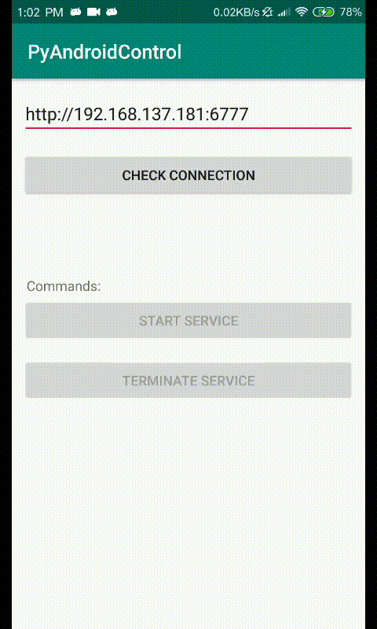

# PyAndroidControl
Your Remote ADB controller. Control your Android device via python scripts. 

## Architecture


## Usage
### 1. Install the App
Install [PyAndroidControl App](https://github.com/nladuo/PyAndroidControl/releases), and make sure the App has **Root Permission**.

### 2. Write your Logics
Change the [simple-control-server/logics.py](simple-control-server/logics.py) to what ever you want.
```
def get_commands(token, img_file):
    """ analyze the screenshot and send 
        commands back to android device """
    img_file.save("tmp.png")
    print(token)

    # your adb shell commands
    cmds = [
        'input text "111"',
        'input text "222"',
        'input text "333"',
    ]
    return cmds

```
### 3. Control your Device



## Remote ADB Control
Mock adb with PyAndroidControl, check [remote-adb-control](remote-adb-control).

- 1. First Start [remote-adb-control/center-server/control_server.py](remote-adb-control/center-server/control_server.py)
- 2. Then use the [remote-adb-control/control-client/remote_adb_api.py](remote-adb-control/control-client/remote_adb_api.py) to control your device like using ADB.


## License
MIT
